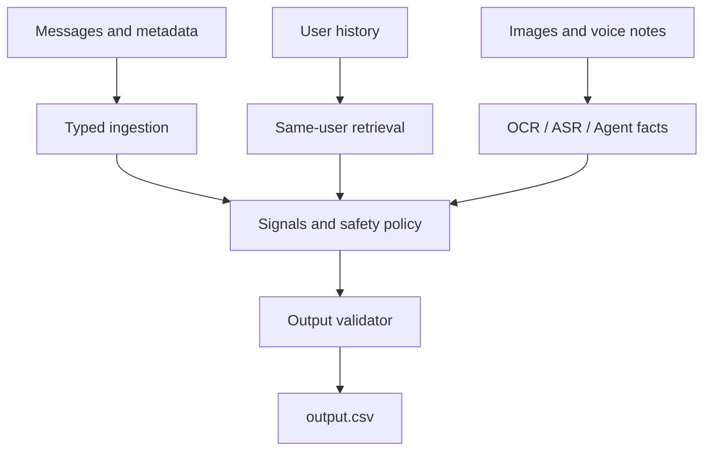

# Multimodal WhatsApp Notification Router

> Built for **HackerRank Orchestrate — August 2026**  
> Final Rank: **#101 / 1,983 — Top 5.1%**

A safety-first multimodal notification router that decides whether an incoming
WhatsApp message should `notify`, `digest`, or `mute`.

## What I Built

A safety-first multimodal notification router that combines personalized history
retrieval, deterministic policy rules, OCR/ASR enrichment, and an optional AI
Agent Gateway.

The system processes text messages, image posters/screenshots, and voice notes.
It uses user behavior, group and business metadata, historical interactions,
urgency, repetition, and safety signals to make personalized routing decisions.

Key capabilities:

- deterministic offline routing with no third-party runtime dependencies;
- personalized retrieval restricted to the same user and prior messages;
- image enrichment through isolated VLM requests;
- local voice transcription with `faster-whisper`, followed by bounded fact extraction;
- hard safety precedence for scams, credential theft, suspicious links, prompt
  injection, and unsafe forwarded advice;
- optional OpenAI-compatible Agent Gateway with batching, concurrency limits,
  retries, rate limiting, caching, and quality gates; and
- exact six-column output validation with atomic CSV replacement.

Read the [full challenge statement](./problem_statement.md) for the original task
and [the implementation README](./code/README.md) for detailed setup,
configuration, evaluation, and packaging instructions.

## Architecture

The Agent extracts objective content facts only. Final personalization, safety
precedence, and routing decisions remain inside the deterministic local policy.



More detail is available in [ARCHITECTURE.md](./code/ARCHITECTURE.md).

## Quick Start

Requirements:

- Python 3.11 or newer
- the provided `dataset/` directory

From the repository root:

```bash
python -m venv code/.venv
python -m pip install --upgrade pip
python -m pip install -e ./code
python code/main.py route --dataset dataset --output dataset/output.csv --mode offline
```

Activate the virtual environment before installation if desired:

- Windows PowerShell: `code\.venv\Scripts\Activate.ps1`
- macOS/Linux: `source code/.venv/bin/activate`

The core `offline` mode uses only the Python standard library and makes no
network requests.

## Routing Modes

| Mode | Behavior |
| --- | --- |
| `offline` | Deterministic local routing with no API or secret required |
| `auto` | Enriches all items when the Agent API is configured; otherwise falls back safely |
| `hybrid` | Sends uncertain text and all media for enrichment while keeping final decisions local |
| `api` | Requires full Agent coverage and enforces the configured success-ratio gate |

## Output Contract

Every row in `dataset/messages.csv` produces exactly one validated output row:

| Column | Meaning |
| --- | --- |
| `message_id` | Incoming message ID |
| `action` | `notify`, `digest`, or `mute` |
| `message_type` | Best-fit message category |
| `reason` | Short human-readable explanation |
| `confidence` | Number from `0` to `1` |
| `evidence_message_ids` | Relevant historical message IDs, or `none` |

## Evaluation and Tests

The leakage-safe evaluator strips labels before invoking the public CLI and joins
predictions to labels only after routing:

```bash
python code/evaluation/main.py --dataset dataset --labels dataset/sample_messages.csv --mode offline
```

The final public-example regression passes all **30/30 action/type pairs**. This
describes the provided examples only and is not a claim about hidden-set
performance.

Run the focused test suite with:

```bash
python -m unittest discover -s code/tests -p "test_*.py" -v
```

Tests cover output invariants, atomic writes, evidence constraints, prompt
injection, path confinement, media validation, batch parsing, concurrency,
timeouts, retries, request budgets, cache isolation, evaluation leakage, and
failure fallback.

## Repository Layout

```text
.
├── README.md
├── problem_statement.md
├── code/
│   ├── main.py
│   ├── router/
│   ├── evaluation/
│   ├── tests/
│   ├── prompts/
│   ├── ARCHITECTURE.md
│   ├── README.md
│   └── pyproject.toml
└── dataset/
    ├── messages.csv
    ├── sample_messages.csv
    ├── output.csv
    └── media/
```

## License

The implementation under `code/` is available under the
[MIT License](./code/LICENSE). Challenge materials and datasets remain subject to
their original terms.
